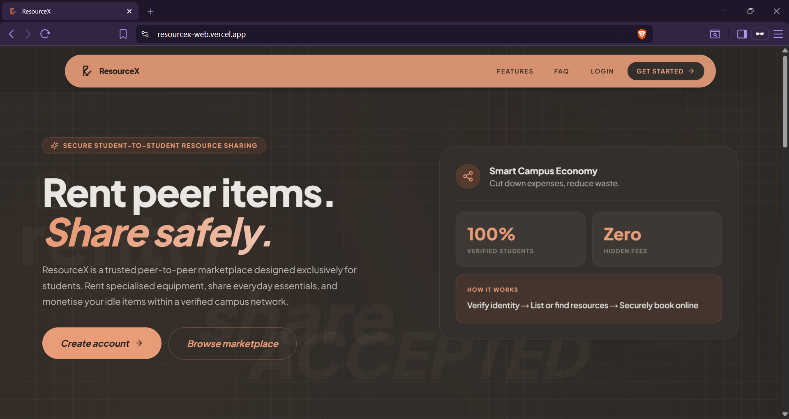

# ResourceX

> A trusted campus marketplace for students to borrow, lend, and manage academic resources within a verified university community.

<p align="left">
  <a href="https://oracle.com/java"></a>
  <a href="https://spring.io/projects/spring-boot"></a>
  <a href="https://nextjs.org"></a>
  <a href="https://typescriptlang.org"></a>
  <a href="https://tailwindcss.com"></a>
  <a href="https://mysql.com"></a>
  <a href="https://flywaydb.org"></a>
</p>

## Project Overview

**ResourceX** is a secure peer-to-peer campus marketplace built exclusively for university students to easily borrow and lend academic and daily resources—such as textbooks, calculators, electronics, lab equipment, and study notes. Unlike informal and chaotic social media groups where coordination frequently breaks down and spam is common, ResourceX uses academic email gating to verify that every user belongs to the same campus community, building an inherent foundation of trust. To share or borrow an item, a student simply lists their resource or submits a date-specific reservation request; once the owner approves, the parties coordinate handoffs directly using integrated real-time chat, and subsequently confirm the item’s return while building a reliable transaction history.

To maintain trust within the community, ResourceX tracks member accountability through an automated reputation system. Positive interactions strengthen a student's standing, while repeated misuse can restrict certain marketplace actions, helping keep the platform reliable and safe.

<p align="center">
  
</p>

> ResourceX is developed as part of a Level 2 Term 2 coursework project at the Department of Computer Science and Engineering (CSE), CUET.

Built using Next.js, Spring Boot, MySQL, Flyway, and WebSocket technologies.

🌐 **Live Demo:** https://resourcex-web.vercel.app

---

## Table of Contents

1. [Key Features](#key-features)
2. [Architecture](#architecture)
3. [Repository Layout](#repository-layout)
4. [Technology Stack](#technology-stack)
5. [Local Setup](#local-setup)
6. [Environment Variables](#environment-variables)
7. [API Overview](#api-overview)
8. [Deployment](#deployment)
9. [Testing & Verification](#testing--verification)
10. [License](#license)

---

## Key Features

- **Academic Email Gating:** Restricts registration validation checks exclusively to approved university email domains. Valid users are activated using a secure one-time password (OTP) flow dispatched via SMTP, preventing external access.
- **Booking State Machine:** Coordinates rental transactions through structured states, tracking item status from submission, owner approval or rejection, pickup, to safe return. This ensures availability states remain consistent.
- **Real-Time Direct Messaging:** Connects borrowers and lenders via integrated direct chat powered by STOMP WebSockets, enabling real-time pickup coordination without sharing personal contact information.
- **Reputation Tracking:** Encourages member accountability through an automated rating tier system. Standings adjust dynamically based on transaction completions and ratings, restricting features for accounts with repeated negative behaviors.
- **Resource Search & Filtering:** Allows students to query the marketplace index dynamically, sorting and filtering resources by item categories, condition, availability scopes, and query keywords.
- **Notifications & Booking Updates:** Sends real-time system alerts and status updates immediately when a booking is requested, approved, completed, or cancelled, keeping users informed at each transaction stage.

---

## Architecture

ResourceX uses a decoupled multi-tier architecture to separate user interfaces, business logic, and persistent storage:

```text
  [ Browser ]
      │  ▲
      │  │ HTTP (REST API) & WebSockets (STOMP)
      ▼  │
  [ Next.js Frontend ]
      │  ▲
      │  │ Proxy Rewrite
      ▼  │
  [ Spring Boot Backend ]
      │
      ▼ (Spring Data JPA / Hibernate)
  [ MySQL Database ]
```

- **Frontend Client:** React-based Next.js App Router application. Session and notification state utilizes the React Context API.
- **Backend API:** Stateless Spring Boot application. Requests are authenticated using tokens passed inside secure HTTP-only cookies.
- **WebSockets:** Direct messaging and notifications route over WebSocket channels using the STOMP protocol.
- **Database Interaction:** Spring Data JPA and Hibernate map entities dynamically to transaction databases and handle database-level constraint checking.

---

## Repository Layout

```text
ResourceX/
├── assets/                   # Documentation assets
│   └── images/
│       └── home-page.png     # Application landing page screenshot
├── backend/                  # Java 21 Spring Boot REST & WebSocket Server
│   ├── src/main/java/        # Security configs, API controllers, services, repositories
│   ├── src/main/resources/   # Config files, Flyway schema migrations
│   ├── Dockerfile            # Multi-stage production container build configuration
│   └── pom.xml               # Maven dependency specifications
├── database/                 # Production SQL references
│   ├── schema.sql            # MySQL baseline schema reference
│   └── seed_data.sql         # Default startup records
└── frontend/
    └── web/                  # Next.js React client application
        ├── app/              # App router pages (dashboard interfaces and auth layouts)
        ├── components/       # Reusable layout widgets
        ├── context/          # React context handlers (Auth, notifications)
        ├── hooks/            # Custom React hooks (chat, upload managers)
        ├── lib/              # Axios API setup, formatting utilities
        └── package.json      # Frontend package configuration
```

---

## Technology Stack

| Layer | Technology | Purpose |
| :--- | :--- | :--- |
| **Frontend** | Next.js 14, React 18, TypeScript 5 | Client-side routing, page rendering, and SPA views |
| **Styling** | Tailwind CSS 3 | UI layouts and responsive typography |
| **Backend** | Java 21, Spring Boot 3.3.5 | REST API, STOMP WebSockets, and scheduler jobs |
| **Database** | MySQL 8.4, H2 (Local), Flyway | Persistent storage, local DB testing, schema versioning |
| **Security** | Spring Security, JJWT | Stateless validation, cookie-based session verification |
| **Testing** | JUnit 5, Mockito, Jest | Unit and integration test validation |

---

## Local Setup

### Prerequisites
- **Java JDK:** Version 21
- **Node.js:** Version 20.x or newer (with the `npm` package manager)
- **Database (Optional):** MySQL 8.x (Local configurations use an in-memory database by default)

### Step 1: Configure Environment Variables
Duplicate the environment template file at the root directory:

```bash
cp .env.example .env
```

*Note: Edit `.env` to define required variables like email credentials prior to running user activation features.*

### Step 2: Run the Backend Service
Navigate to the backend directory and run the application:

```bash
cd backend

# Linux/macOS
./mvnw spring-boot:run -Dspring-boot.run.profiles=local

# Windows
.\mvnw.cmd spring-boot:run -Dspring-boot.run.profiles=local
```

On startup, the local profile initializes the in-memory database schema automatically.

- **Local API Base:** `http://localhost:8082`

### Step 3: Run the Frontend Client
Navigate to the web client root folder, install dependencies, and run the developer server:

```bash
cd ../frontend/web
npm install
npm run dev
```

Open a web browser and navigate to: `http://localhost:3000`

---

## Environment Variables

The project uses a unified `.env` file at the root. The key public configurations are:

| Variable | Scope | Purpose | Value Guide / Constraint |
| :--- | :--- | :--- | :--- |
| `DB_HOST` | Backend | Database host address | `YOUR_DATABASE_URL` |
| `DB_PORT` | Backend | Database port | `3306` |
| `DB_NAME` | Backend | Relational database catalog identifier | `YOUR_DATABASE_NAME` |
| `DB_USERNAME` | Backend | Database login username | `YOUR_DATABASE_USER` |
| `DB_PASSWORD` | Backend | Database login password | `YOUR_DATABASE_PASSWORD` |
| `JWT_SECRET` | Backend | Secret string key used to sign session cookies | `YOUR_JWT_SECRET` |
| `MAIL_USERNAME` | Backend | SMTP login email address to dispatch user activation mails | `YOUR_SMTP_USERNAME` |
| `MAIL_APP_PASSWORD` | Backend | SMTP login verification credentials | `YOUR_SMTP_CONFIGURATION` |
| `PORT` | Backend | Server port of the backend API engine | `8082` |
| `BACKEND_API_URL` | Frontend | Target API server URL accessed during SSR | `http://localhost:8082` |
| `NEXT_PUBLIC_API_BASE_URL`| Frontend | Target API WebSocket address accessed in the browser | `http://localhost:8082` |

---

## API Overview

Protected endpoints verify authentication tokens passed inside cookie headers. Payload objects are serialized in standard JSON formats.

### Authentication & OTP
- `POST /api/auth/register` — Registers new student profile credentials.
- `POST /api/auth/login` — Validates credentials and returns a secure validation cookie.
- `POST /api/auth/logout` — Resets session states and invalidates tokens.
- `GET /api/auth/me` — Returns active session properties for the verified user.
- `POST /api/otp/request` — Generates a verification activation code sent via SMTP.
- `POST /api/otp/verify` — Validates OTP codes to activate pending memberships.

### Resource Listings
- `POST /api/items` — Publishes a new resource item to the catalog.
- `GET /api/items` — Returns a paginated listing index (filterable by category).
- `GET /api/items/{id}` — Returns metadata for a specific listing item.
- `PUT /api/items/{id}` — Updates properties of an active item.
- `DELETE /api/items/{id}` — Removes or archives item listing availability.

### Bookings
- `POST /api/bookings` — Requests a date-restricted reservation for an item.
- `GET /api/bookings/me` — Returns list of requests made by the active user.
- `PATCH /api/bookings/{id}/approve` — Accepts a pending reservation (lender action).
- `PATCH /api/bookings/{id}/activate` — Confirms physical item pickup, initiating rental.
- `PATCH /api/bookings/{id}/complete` — Confirms physical return of the item.
- `PATCH /api/bookings/{id}/cancel` — Cancels a booking request.

---

## Deployment

- **Web Portal:** Deployed as a static single-page app, proxying request traffic on `/api/*` and `/ws-endpoint/*` to the backend service.
- **REST & WS Backend:** Containerized and hosted on cloud container runtime services, with environment properties mapped dynamically from secret managers.
- **Database Engine:** Managed MySQL instances provide persistent storage for users, resources, bookings, and messages.

---

## Testing & Verification

Automated test configurations validate both frontend and backend structures:

### Backend Testing (JUnit 5 / Mockito)
Executes transaction logic, mapper parsing, and access configurations.
```bash
cd backend
./mvnw test
```

### Frontend Testing (Jest / Testing Library)
Executes web page layouts, context state updates, and helper utility assertions.
```bash
cd frontend/web
npm test
```

---

## License

This project is proprietary and intended for academic, portfolio, and review purposes only.

See the [LICENSE](./LICENSE) file for complete terms and restrictions.
